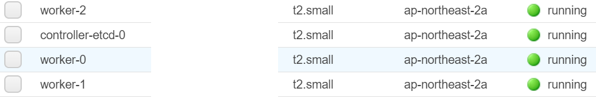
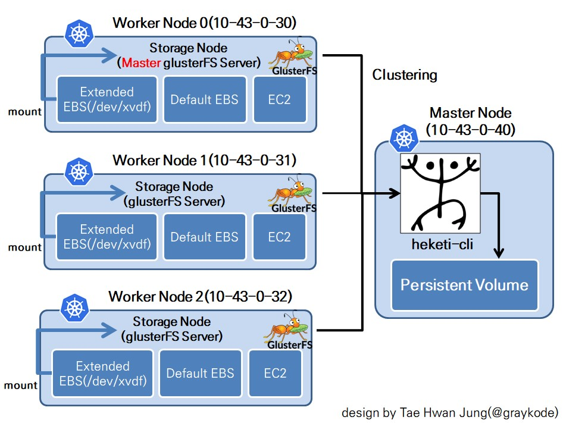

## Kubernetes-glusterfs-aws

This is simple tutorial about file system clustering using `glusterfs` with `heketi` in `kubernetes` environment on `aws` platform.

<p align="center">


</p>


## 0. How to Configure Kubernetes in aws platform?

I already configured `kubernetes` on `aws` platform using [alicek106/aws-terraform-kubernetes](https://github.com/alicek106/aws-terraform-kubernetes).

You can more easily Set up combination with `Terraform`, `ansible`, `kubespray`!. They just do it all!.


#### Note : when Set Variables in variables.tf, I recommend you like this.

```
number_of_controller = 0

number_of_etcd = 0

number_of_controller_etcd = 1
```

Then, You can see finished aws setting.




## 1. Overall Network System

<p align="center"></p>

I referenced code from [psyhomb/heketi](https://github.com/psyhomb/heketi).

copy your `.ppk` key `docker` to `master node(10.43.0.40)`

```shell
root@terraform-aws-kube:/aws-terraform-kubernetes/ansible$scp -i ../keys/tf-kube ../keys/tf-kube ubuntu@<your master node's public address>:/home/ubuntu
```

please connect `docker` to `master node(10.43.0.40)`

```shell
root@terraform-aws-kube:/aws-terraform-kubernetes/ansible$ssh -i ../keys/tf-kube ubuntu@<your master node's public address>
```

#### Tips.

In `ec2`, you can access the **root** directly through `ssh` or `scp` by setting as shown below.

```shell
root@ip-10-43-0-40:/home/ubuntu$ vim /root/.ssh/authorized_keys
```

Then, remove this line

```
no-port-forwarding,no-agent-forwarding,no-X11-forwarding,command="echo 'Please login as the user \"ubuntu\" rather than the user \"root\".';echo;sleep 10"
```


#### 1.1 Install and setting gluster server in all Node 0,1,2.(Attention!except Master node!)

Please install gluster server in all your Woker Node. 

##### Note  Part of (1.1 Install and Setting) apply all node in the same(ip-10-43-0-30, ip-10-43-0-31, ip-10-43-0-32)

I suffered Trouble shooting when i had used old version gluster(3.1.0) 😥😥, but after fixed 4.1 version, It is worked!!

```shell
root@ip-10-43-0-30:~$ apt install software-properties-common
root@ip-10-43-0-30:~$ add-apt-repository ppa:gluster/glusterfs-4.1
root@ip-10-43-0-30:~$ apt-get update && apt-get upgrade
root@ip-10-43-0-30:~$ apt install thin-provisioning-tools
root@ip-10-43-0-30:~$ apt install glusterfs-server glusterfs-client
```


check `glusterfs-server` status

```shell
root@ip-10-43-0-30:~$ service glusterd start
root@ip-10-43-0-30:~$ service glusterd status
```

**Do this(1.1 chapter) apply to other nodes in the same**


#### 1.2 Configure file

please return to `ip-10-43-0-40(kubernetes master)`

Install `kubectl` in [Install kubectl binary using curl](https://kubernetes.io/docs/tasks/tools/install-kubectl/).

```shell
root@ip-10-43-0-40:/home/ubuntu$ curl -LO https://storage.googleapis.com/kubernetes-release/release/$(curl -s https://storage.googleapis.com/kubernetes-release/release/stable.txt)/bin/linux/amd64/kubectl
root@ip-10-43-0-40:/home/ubuntu$ chmod +x ./kubectl
root@ip-10-43-0-40:/home/ubuntu$ mv ./kubectl /usr/local/bin/kubectl
```


Check your node using `kubectl get nodes`.

```shell
root@ip-10-43-0-40:/home/ubuntu$ kubectl get nodes
NAME                                            STATUS   ROLES    AGE   VERSION
ip-10-43-0-30.ap-northeast-2.compute.internal   Ready    node     61m   v1.12.3
ip-10-43-0-31.ap-northeast-2.compute.internal   Ready    node     61m   v1.12.3
ip-10-43-0-32.ap-northeast-2.compute.internal   Ready    node     61m   v1.12.3
ip-10-43-0-40.ap-northeast-2.compute.internal   Ready    master   63m   v1.12.3
```


Set Linux Shortcut Settings

```shell
root@ip-10-43-0-40:/home/ubuntu$ node1='ip-10-43-0-30.ap-northeast-2.compute.internal'
root@ip-10-43-0-40:/home/ubuntu$ node2='ip-10-43-0-31.ap-northeast-2.compute.internal'
root@ip-10-43-0-40:/home/ubuntu$ node3='ip-10-43-0-32.ap-northeast-2.compute.internal'
```


Create required directories.

```shell
root@ip-10-43-0-40:~$ mkdir -p /data/heketi/{db,.ssh} && chmod 700 /data/heketi/.ssh
```


Create required directories to all nodes

```shell
root@ip-10-43-0-40:~$ for NODE in $node1 $node2 $node3; do ssh -i tf-kube root@${NODE} 'mkdir -p /data/heketi/{db,.ssh} && chmod 700 /data/heketi/.ssh'; done
```


Generate heketi ssh keys that will be used by heketi api for password-less login to glusterfs servers

```shell
root@ip-10-43-0-40:/home/ubuntu$ ssh-keygen -t rsa -b 2048 -f /data/heketi/.ssh/id_rsa
```

##### Note When blank space about passpharse, just press Enter as skipping


Copy `.ssh` dir to all glusterfs servers using `scp`.

```shell
root@ip-10-43-0-40:/home/ubuntu$ for NODE in $node1 $node2 $node3; do scp -i tf-kube -r /data/heketi/.ssh root@${NODE}:/data/heketi; done
```


Import `ssh` public key to all glusterfs servers (node1, node2 and node3 in our example)

```shell
root@ip-10-43-0-40:/home/ubuntu$ for NODE in $node1 $node2 $node3; do cat /data/heketi/.ssh/id_rsa.pub | ssh -i tf-kube root@${NODE} "cat >> /root/.ssh/authorized_keys"; done
```


#### 1.3 Configure Heketi Cli and kubernetes

```shell
root@ip-10-43-0-40:/home/ubuntu$ git clone https://github.com/graykode/kubernetes-glusterfs-aws && cd kubernetes-glusterfs-aws
```


##### In now, We assume that we are at /home/ubuntu/kubernets-glusterfs-aws and use the ip-10-43-0-40 node.

You have to use `HEKETI_VERSION` `8.0.0`

```shell
$ chmod +x heketi.sh
$ ./heketi.sh
$ heketi-cli -v
heketi-cli v8.0.0
```


Add label on all Kubernetes nodes with GlusterFS

```shell
$ kubectl label node $node1 storagenode=glusterfs
$ kubectl label node $node2 storagenode=glusterfs
$ kubectl label node $node3 storagenode=glusterfs
```


In `kubernetes/heketi-secret.yaml`, key do role about password. You can change key or not. this is optional point. If you want to set password(key) as `12345678`, `echo -n '12345678' | base64` then write `MTIzNDU2Nzg=` in `kubernetes/heketi-secret.yaml` key


Create Secret Object in kubernetes. 

```shell
$ kubectl apply -f kubernetes/heketi-secret.yaml
```


Create heketi api deployment and service objects

```shell
$ kubectl apply -f kubernetes/heketi-deployment.json
```


##### You can get a number of api server port.

In below this, `30257` is a number of your api server port.

```shell
$ kubectl get svc -l glusterfs=heketi-service
NAME     TYPE       CLUSTER-IP      EXTERNAL-IP       PORT(S)          AGE
heketi   NodePort   X.X.X.X          <none>        8080:30257/TCP      16s
```


Check your api server is fine.

```shell
$ curl -s $node1:30257/hello
```


#### 1.4 Attach EBS in your each EC2

It is recommended that you create an EBS volume of 10GB or more. After Creating, Attach to your each ec2 node(**just only woker node 1,2,3, not master**)

Then, run this to make topology network clustering. (Assume that the password is `password`)

```shell
$ heketi-cli --user admin --secret password --server http://$node1:30257 topology load --json heketi-topology.json
```


Then, run this to see topology information.

```shell
$ heketi-cli --user admin --secret password --server http://$node1:30257 topology info
```


##### Tips.

If you took some mistake when making topology, you can delete object(topology, node, volume or device) like this.

```shell
$ heketi-cli --user admin --secret password --server http://$node1:30257 topology node delete <nodeid> # delete node which has nodeid
$ heketi-cli --user admin --secret password --server http://$node1:30257 topology device delete <deviceid> # delete node which has deviceid
$ heketi-cli --user admin --secret password --server http://$node1:30257 topology cluster delete <clusterid> # delete node which has clusterid
```


#### 1.5 Heketi DB

Create glusterfs shared volume

```shell
$ heketi-cli --user admin --secret password --server http://$node1:30257 setup-openshift-heketi-storage --listfile heketi-storage.json
```


Migrate Heketi database to previously created glusterfs volume\

```shell
$ kubectl apply -f heketi-storage.json
```


Check status

```shell
$ kubectl get job -o wide
```


Then, heketi database migrated to `heketidbstorage` glusterfs replicated volume and remove local.

```shell
$ for NODE in $node1 $node2 $node3; do ssh -i ../tf-kube root@${NODE} "rm -f /data/heketi/db/heketi.db && mount.gluster
fs ${NODE}:/heketidbstorage /data/heketi/db"; done
```


##### Tips.

If you want to make mount persistent, Please refer to [here](https://github.com/psyhomb/heketi#heketi-db).


#### 1.6 Kubernetes StorageClass object

Set your cluster id in `heketi-storageclass.yaml` by `$ heketi-cli --user admin --secret password --server http://$node1:30257 topology info`. After it, Create storageclass Object in Kubernetes.

```shell
$ kubectl apply -f kubernetes/heketi-storageclass.yaml
$ kubectl get storageclass
```


#### 1.7 Kubernetes PersistentVolumeClaim

```shell
$ kubectl apply -f kubernetes/heketi-pvc.yaml
$ kubectl get pvc test-claim
$ kubectl get pv
```


Check your pvc obejct fine

```shell
$ kubectl describe pvc test-claim
# Successfully provisioned volume pvc
```


## To Next Job

binding pvc with flask docker deployment.


## License

This Project license from TaeHwan Jung(Who modify more easily) and Miloš Bunčić(Orignal repository).


## Author

- Tae Hwan Jung(@graykode)
- My Email : nlkey2022@gmail.com